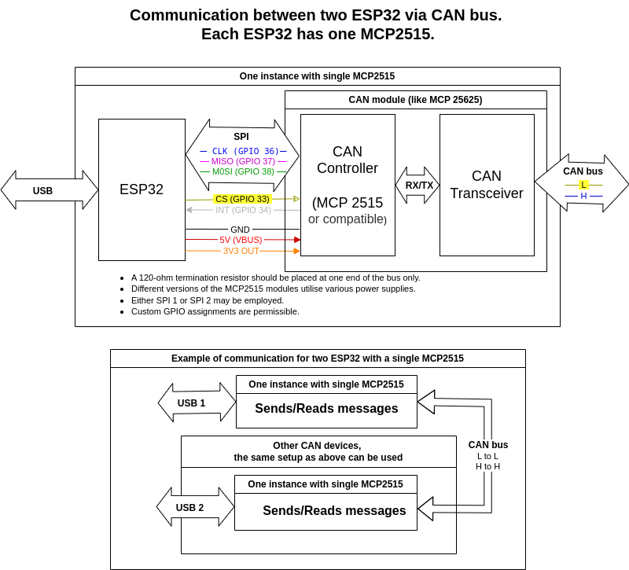
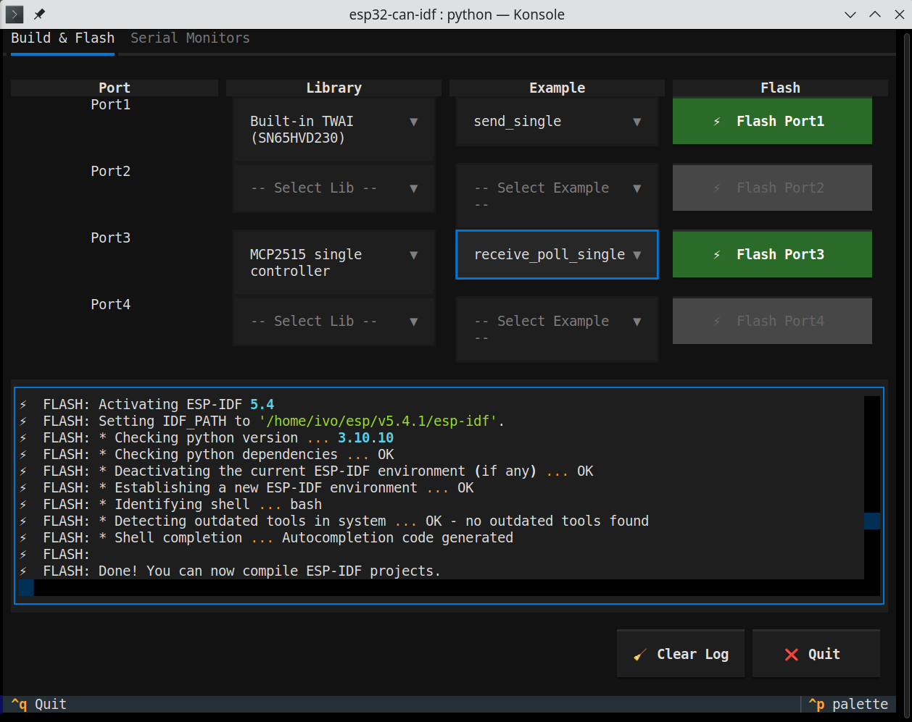
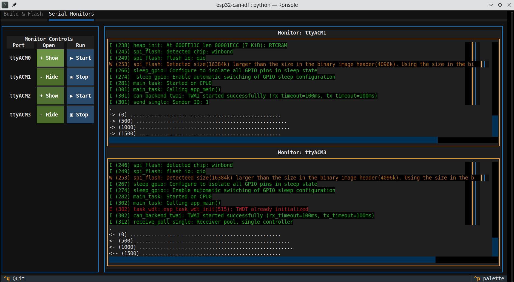

# can-multibackend-idf

Unified CAN-bus interface and example suite for ESP-IDF
========================================================

This project provides a modular, unified interface for CAN bus communication on ESP-IDF platforms (ESP32, ESP32-S3, ESP32-C3, ESP32-C6), supporting multiple hardware backends (TWAI, MCP2515 single/multi) and a suite of ready-to-use examples. It is designed for easy switching between different CAN controllers and for rapid prototyping or testing of CAN networks.

## Features
- Unified API for multiple CAN backends (TWAI, MCP2515 single/multi)
- Example applications for sending/receiving CAN messages (polling/interrupt)
- Easy configuration via Kconfig (menuconfig)
- Python-based flash manager with GUI for multi-device workflows

## Supported CAN Backends
- **Built-in TWAI (SN65HVD230)** — ESP32's native CAN controller
- **MCP2515 single controller** — via SPI, for external CAN modules
- **MCP2515 multi-controller** — for setups with multiple MCP2515 chips

## Example Applications
- `send_single` — Send CAN messages (single controller)
- `receive_poll_single` — Receive CAN messages (polling, single controller)
- `receive_interrupt_single` — Receive CAN messages (interrupt, single controller)
- `send_multi` — Send CAN messages (multi-controller)
- `receive_poll_multi` — Receive CAN messages (polling, multi-controller)
- `receive_interrupt_multi` — Receive CAN messages (interrupt, multi-controller)

## Typical Wiring (MCP2515 example)


- A 120-ohm termination resistor should be placed at one end of the bus only.
- Custom GPIO assignments are possible (see code).
- Either SPI1 or SPI2 may be used.

## Flashing and Build

### 1. Using ESP-IDF (manual)
```sh
idf.py menuconfig   # Select CAN backend and example
idf.py build
idf.py -p /dev/ttyACM0 flash
```

### 2. Using Python Flash Manager
The `flash_manager.py` tool provides a comprehensive Textual-based GUI for managing ESP32 development workflows. It simplifies the entire build-flash-monitor cycle through an intuitive terminal interface, automatically detecting connected devices and handling ESP-IDF environment setup. Ideal for projects with multiple ESP32 boards requiring different configurations.

```sh
python3 flash_manager.py
```

#### Building and Flashing with Flash Manager


The **Build & Flash** tab streamlines firmware deployment:
- Auto-detects connected ESP32 devices (ttyACM*, ttyUSB*)
- Select CAN backend (TWAI, MCP2515 single/multi) and example application per device
- Validates configuration dependencies automatically
- Manages isolated build workspaces for each lib/example combination
- Displays real-time compilation output with color-coded logging
- Handles complete workflow: configuration → build → flash in one click
- Uses optimal parallel jobs based on available CPU and memory

#### Monitoring Serial Ports


The **Serial Monitors** tab enables real-time device monitoring:
- Open multiple serial monitors simultaneously for connected devices
- Real-time output streaming with configurable buffering
- Start/Stop individual monitors without affecting others
- Hide/Show monitor logs while keeping background logging active
- Automatic port detection and fake ports for testing
- Character-by-character or buffered output display
- Supports monitoring alongside build operations


## Project Structure
- `components/` — Modular CAN backends and dispatcher
- `examples/` — Example applications
- `main/` — Project entry point and Kconfig configuration
- `py/` — Python flash manager tool with GUI and backend logic
- `doc/` — Documentation and wiring diagrams

## License
MIT License — see [LICENSE](LICENSE)

---

*Author: Ivo Marvan, 2025*
