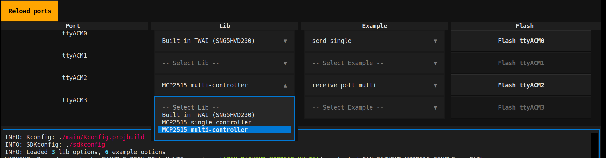

# esp32-can-idf

Unified CAN-bus interface and example suite for ESP32
====================================================

This project provides a modular, unified interface for CAN bus communication on ESP32, supporting multiple hardware backends (TWAI, MCP2515 single/multi, Arduino) and a suite of ready-to-use examples. It is designed for easy switching between different CAN controllers and for rapid prototyping or testing of CAN networks with ESP32.

## Features
- Unified API for multiple CAN backends (TWAI, MCP2515 single/multi, Arduino)
- Example applications for sending/receiving CAN messages (polling/interrupt)
- Easy configuration via Kconfig (menuconfig)
- Python-based flashing manager for multi-device workflows

## Supported CAN Backends
- **Built-in TWAI (SN65HVD230)** — ESP32's native CAN controller
- **MCP2515 single controller** — via SPI, for external CAN modules
- **MCP2515 multi-controller** — for setups with multiple MCP2515 chips
- **Arduino CAN port** (experimental, not yet implemented)

## Example Applications
- `send_single` — Send CAN messages (single controller)
- `receive_poll_single` — Receive CAN messages (polling, single controller)
- `receive_interrupt_single` — Receive CAN messages (interrupt, single controller)
- `send_multi` — Send CAN messages (multi-controller)
- `receive_poll_multi` — Receive CAN messages (polling, multi-controller)
- `receive_interrupt_multi` — Receive CAN messages (interrupt, multi-controller)

## Typical Wiring (MCP2515 example)


- A 120-ohm termination resistor should be placed at one end of the bus only.
- Custom GPIO assignments are possible (see code).
- Either SPI1 or SPI2 may be used.

## Flashing and Build

### 1. Using ESP-IDF (manual)
```sh
idf.py menuconfig   # Select CAN backend and example
idf.py build
idf.py -p /dev/ttyACM0 flash
```

### 2. Using Python Flash Manager
For complex setups (multiple ESP32s, different CAN configs), use the Python tool `flash_manager.py` for a graphical and automated workflow:

```sh
python3 flash_manager.py
```

- Select the port, CAN backend, and example for each connected ESP32.
- The tool handles configuration, build, and flashing for each device.



## Project Structure
- `components/` — Modular CAN backends and dispatcher
- `examples/` — Example applications
- `main/` — Project entry, Kconfig
- `py/` — Python utilities (flash_manager.py and logic)
- `doc/` — Documentation and wiring diagrams

## License
MIT License — see [LICENSE](LICENSE)

---

*Author: Ivo Marvan, 2025*
